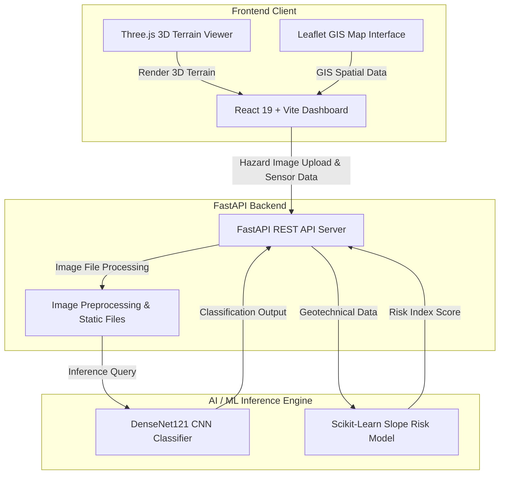

# KaWatch

KaWatch is a modern, real-time **Rockfall & Slope Stability Monitoring System** designed for geotechnical safety and hazard assessment. The application integrates an interactive 3D spatial terrain viewer, GIS mapping, real-time analytics, a FastAPI microservice, and a dual AI/ML inference engine utilizing a fine-tuned **DenseNet121** deep learning model alongside a classical Scikit-Learn slope risk predictor.

---

### 🛠️ Tech Stack & Technologies


---

## Technical Stack

| Component | Technologies Used |
| :--- | :--- |
| **Frontend UI** | React 19, Vite, Tailwind CSS, Shadcn UI / Radix UI, Lucide Icons |
| **Geospatial & 3D Engine** | Three.js (`@react-three/fiber`, `@react-three/drei`), Leaflet (`react-leaflet`) |
| **Data Analytics** | Recharts, Chart.js, Axios, React Router v7 |
| **Backend API Gateway** | Python 3.10+, FastAPI, Pydantic, Uvicorn |
| **AI / ML Microservice** | TensorFlow 2.x (DenseNet121 CNN), Joblib, Scikit-Learn, NumPy, Pandas, Pillow |

---

## Core System Features

- **3D Slope & Terrain Viewer**: Interactive 3D web rendering of mountain slopes and rockfall zones powered by Three.js and `@react-three/fiber`.
- **Geospatial GIS Mapping**: Real-time Leaflet map integration displaying hazard locations, slope coordinates, and regional risk alerts.
- **DenseNet121 Computer Vision Engine**: Automated image-based rockfall risk classification (Stable vs. Unstable) using a fine-tuned DenseNet121 convolutional neural network.
- **Classical ML Slope Predictor**: Machine learning model evaluating geotechnical metrics (slope angle, soil moisture, rock friction) to predict landslide probability.
- **Real-Time Analytics Dashboard**: Live metrics visualization using Recharts for monitoring sensor feeds, risk indices, and historical trend analysis.

---

## Architecture Diagram



---

## 👥 Contributors & Key Contributions

### 🔹 [Anirban Sil](https://github.com/Anirban-Sil) — *Frontend & Geospatial/3D Visualization Engineer*
- Designed and engineered the React 19 + Vite frontend dashboard using Tailwind CSS and Shadcn UI components.
- Developed the 3D terrain and slope viewer using Three.js (`@react-three/fiber` and `@react-three/drei`) for interactive spatial rockfall rendering.
- Integrated Leaflet GIS mapping (`react-leaflet`) for interactive hazard location tracking and regional heatmaps.
- Built real-time analytics widgets and chart dashboards using Recharts to visualize geotechnical metrics and risk indices.

### 🔹 [Abhiroop Mukherjee](https://github.com/Abhiroop001) — *AI/ML Architect & Backend Engineer*
- Architected the high-performance FastAPI backend REST API with asynchronous endpoints and static file serving.
- Trained and integrated the fine-tuned DenseNet121 CNN model (`best_densenet121.h5`) for automated rockfall stability classification.
- Developed the classical Scikit-Learn machine learning pipeline (`slope_model.pkl`) for predicting slope failure risk based on numerical geological data.
- Built the automated image upload processing, bounding annotation, and JSON inference response pipeline.

---

## Repository Structure

```
KaWatch/
├── Frontend/           # React 19 + Vite client application
│   ├── src/            # Components, 3D Canvas, Maps, Charts
│   └── package.json
├── Backend/            # FastAPI microservice & AI/ML models
│   ├── main.py         # FastAPI application & ML endpoints
│   ├── best_densenet121.h5  # Trained DenseNet121 CNN model
│   ├── slope_model.pkl # Trained Scikit-Learn risk model
│   ├── uploads/        # Uploaded test images
│   └── outputs/        # Processed inference outputs
└── README.md
```

---

## Setup & Local Execution

### 1. Prerequisites
- **Node.js**: v18+
- **Python**: v3.10+
- **pip**: Package manager for Python

---

### 2. Frontend Setup (React + Vite)

```bash
cd Frontend
npm install
npm run dev
```
*Runs locally on `http://localhost:5173` (or default Vite port)*

---

### 3. Backend Setup (FastAPI + AI Models)

```bash
cd Backend
pip install fastapi uvicorn tensorflow joblib pandas numpy pillow pydantic
uvicorn main:app --reload --port 8000
```
*Runs locally on `http://localhost:8000`*

---

## API Summary

### FastAPI Server (`http://localhost:8000`)
- `GET /` — API health check and service status.
- `POST /predict-cnn` — Upload an image to run DenseNet121 CNN inference (returns `stable` vs `unstable` classification & confidence).
- `POST /predict-classical` — Send numerical slope parameters to evaluate geological failure probability.
- `GET /files/{filename}` — Serve uploaded source files.
- `GET /outputs/{filename}` — Serve processed output annotations.

---

## License

Distributed under the MIT License.
